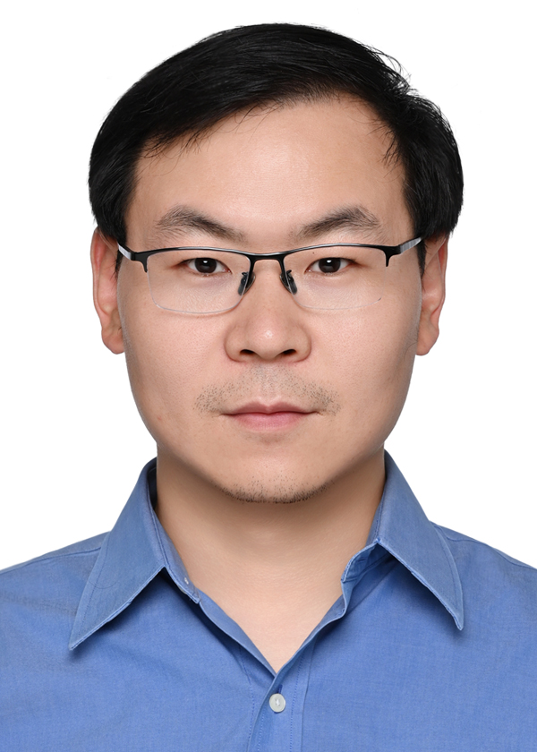

# About Xu

Yuedong Xu is a Professor with College of Computer Science and Artificial Intelligence, Fudan University, China. He received the Ph.D. degree from The Chinese University of Hong Kong in 2009. From 2009 to 2012, he was a Postdoctoral fellow with INRIA Sophia Antipolis and Université d’Avignon, France. He received the French MENRT fellowship in 2009, the OKAWA Foundation research grant in 2019, and the outstanding teacher nomination award in 2022. He serves an an associate editor for IEEE Transactions on Network Science and Engineering. His areas of interests include foundation model training and inference systems, and multimedia networking. He has published a number of papers in premier conferences and journals including USENIX NSDI, USENIX ATC, ACM Mobisys, ACM CoNEXT, ACM Mobihoc, IEEE Infocom, IEEE/ACM ToN and IEEE JSAC.

## Research Interests
- Network for AI
- AI for Networking
- Multi-modal LLM Alignment

If you are interested in any aspect of me, I am always open to discussions and academic collaborations. Feel free to reach out to me at ydxu@fudan.edu.cn

---

## News and Updates

- **Sep 19, 2025**: Our work on Federated LLM Finetuning is accepted to NeurIPS 2025 :sparkles: :smile:
- **Jun 01, 2025**:	Dr. Yuedong Xu has migrated to College of Computer Science and Artificial Intelligence (计算与智能创新学院) and AI3 institute (人工智能创新与产业研究院), Fudan University.

 

