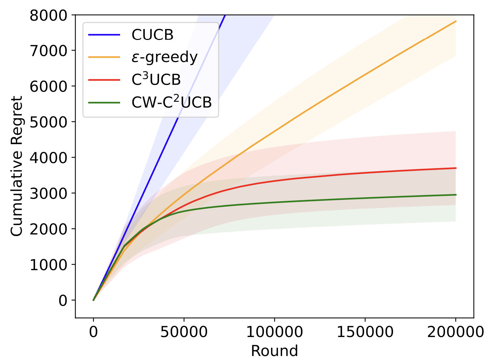
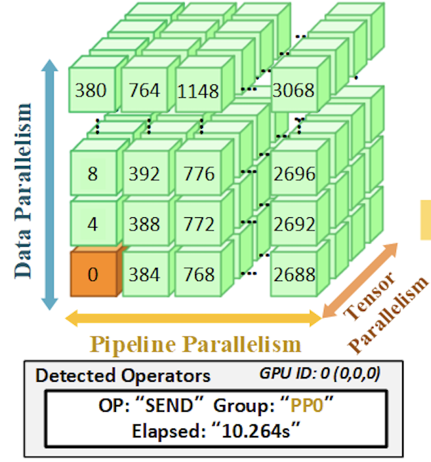
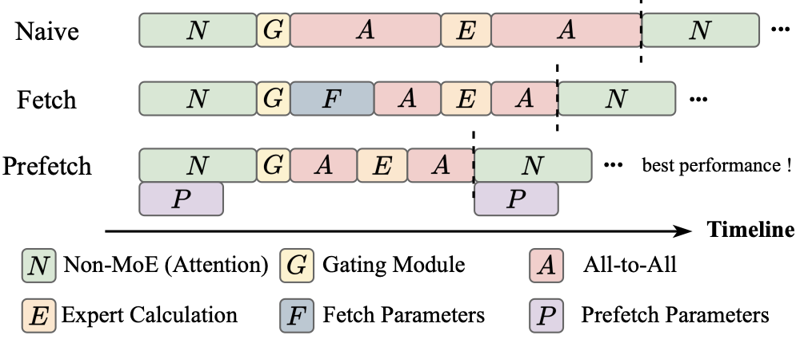
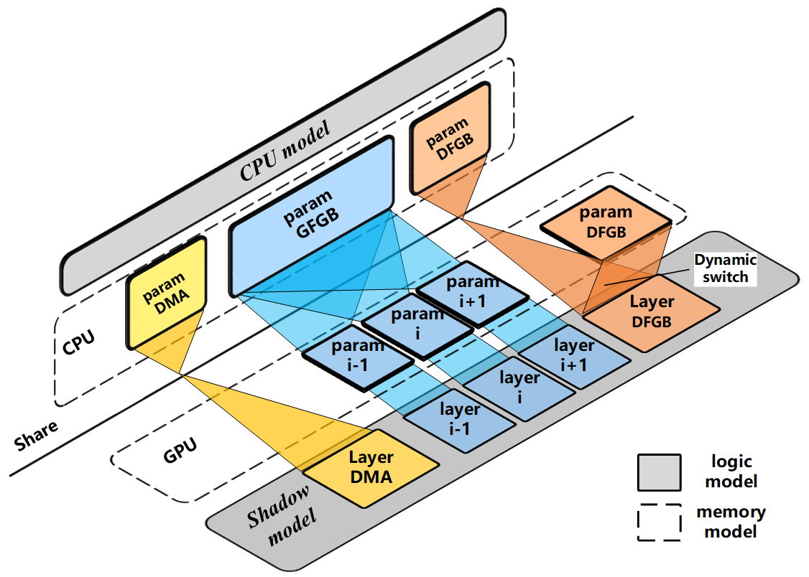

# Publications

## 2025

- Differentially Private Federated Low Rank Adaptation Beyond Fixed-Matrix
Ming Wen^, Jiaqi Zhu^, Yuedong Xu*, and Yipeng Zhou, Dingding Han
NeurIPS, 2025

 

- Holmes: Localizing Irregularities in LLM Training with Mega-scale GPU Clusters
Zhiyi Yao^, Pengbo Hu^, Congcong Miao^, and Xuya Jia, Zuning Liang, Yuedong Xu*, Chunzhi He, Hao Lu, Mingzhuo Chen, Xiang Li, others
USENIX NSDI, 2025

- PopFetcher: Towards Accelerated Mixture-of-Experts Training Via Popularity Based Expert-Wise Prefetch
Junyi Zhang, Chuanhu Ma, Xiong Wang, and Yuntao Nie, Yuqing Li, Yuedong Xu, Xiaofei Liao, Bo Li, Hai Jin
USENIX ATC, 2025

- MemFerry: A Fast and Memory Efficient Offload Training Framework with Hybrid GPU Computation
Zhiyi Yao, Zuning Liang, Yuedong Xu*, and Jin Zhao, Jessie Hui Wang, Tong Li
IEEE Infocom, 2025

- Robust Contextual Combinatorial Multi-Armed Bandits for Unreliable Network Systems
Junkai Wang, Xutong Liu*, Jinhang Zuo, and Yuedong Xu*
IEEE Infocom, 2025

- Link Prediction-Based Measurement Strategy for Efficient Topology Completeness Improvements
Shuying Zhuang, Jessie Hui Wang, Jilong Wang, and 3 more authors
IEEE Trans. Networking, 2025